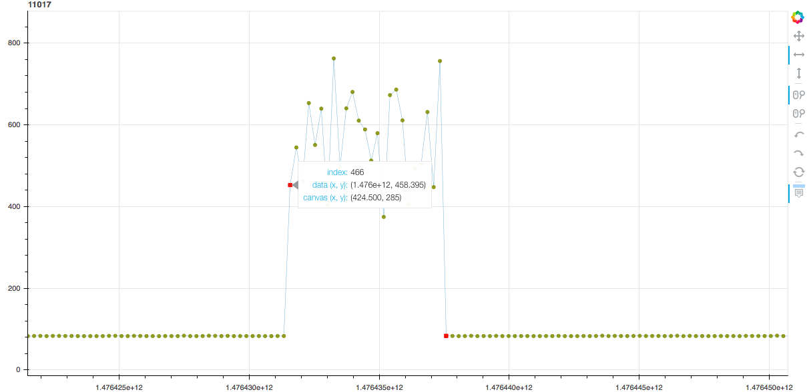

# What is it about?
Visualization tool for RTT trace manual labeling. 

# How to perform manual labeling with the these tools
Example trace is given in the example folder.
Following instructions will be based on the example trace.

## Install python packages
In order to use these tools, please first install all the packages listed
in the [requirements.txt](./requirements.txt):
```
$ pip install -r requirements.txt
```

## Convert to .xlsx to .csv
Some among you might have traces stored in .xlsx file.
Please first convert it to .csv format using [xlsx2csv.py](./xlsx2csv.py).
Some of the these .xlsx files might contain invalid or empty rows.
These rows will lead to errors in conversion. 
Please remove them manually.

For example, to convert all the .xlsx files in the example folder, you can do:
```
$ python xlsx2csv.py -d example/
```

If you were to convert one specific file:
```
$ python xlsx2csv.py -f example/11017.xlsx
```

The resulted __.csv__ file will be stored in the same folder, and have same file prefix.

## Visualize trace
Once .csv files are ready, you can visualize the trace with [visual.py](./visual.py).
The script will produce an __.html__ file and a __.txt__ file with same file prefix.
Open the produced __.html__ in your favorite web browser, you can zoom 
and slide over the entire trace easily.
Produced __.txt__ file is used to store indexes of label data and will be discussed in next section. 

For example, to visualize the example trace [example/11017.csv](example/11017.csv):
```
$ python visual.py -f example/11017.csv
```

The produced html look like the following:


I personally recommend using x-pan/pan and x-zoom to inspect the trace.

## Label data
As shown in the above screen shoot, when you hover the cursor over certain datapoint,
the pop-up window gives you detailed information of this datapoint, such as
index, value, timestamps.

Please label the trace by recording the datapoint index in
the previously produced __.txt__ file.
One index per line.
Please check [example/11017.txt](example/11017.txt) for the exact format.

## Check labeling
Once you've finished labeling one trace, it is recommended to check the
labeled datapoints in a visual way.
With the following command:
```
$ python visual.py -u -f example/11017.csv
```
the __.html__ file will be updated (the __-u__ option) by integrating the indexes
specified in the __.txt__.
Labeled data will be presented in red square as show in the previous screen shoot.

(NOTE: __-u__/__--update__ option forces update. 
Without it, [visual.py](visual.py) will skip
the __.csv__ files already having corresponding __.html__ file.)


## Patch operation
It is recommended to perform labeling and then check the labeled datapoints 
trace by trace.
Still it is possible to generate and update __.html__ files in patch.
```
$ python visual.py -d example/
$ python visual.py -u -d example/
```
The above two commands treat all the __.csv__ files in the given directory.


